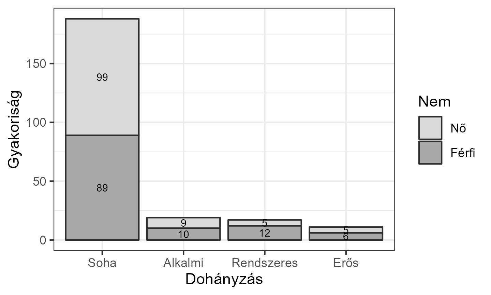

# Publikációkész grafika R-ben

Ez a jegyzet bemutatja, hogyan készíthetünk különböző típusú ábrákat a `{ggplot2}` R csomag segítségével. A következő ábrák létrehozására adunk receptet:

- [hisztogram](#hisztogram-%C3%A9s-bar%C3%A1tai)
- [oszlopdiagram](#oszlopdiagram)
- [dobozdiagram](#dobozdiagram)
- [pontdiagram](#pontdiagram)
- [átlagábra](#%C3%A1tlag%C3%A1br%C3%A1k).

A jegyzet a következő linken érhető el: <https://abarik.github.io/pkgr/>

## Telepítés

A jegyzetben található R kódok kipróbálásához néhány előkészítő lépés szükséges:

- R telepítése: <https://cran.r-project.org/>
- RStudio Desktop telepítése: <https://posit.co/download/rstudio-desktop/>
- R csomagok telepítése:

```r
# szükséges csomagok telepítése R-ben
install.packages("ggplot2")
install.packages("tidyverse")
install.packages("rio")
install.packages("ggh4x")
install.packages("jmv")
install.packages("GGally")
```

- érdemes RStudio projektet létrehozni az R parancsok kipróbáláshoz
  - hozzunk létre egy `adat` nevű könyvtárat a projektkönyvtárban, majd futtassuk
 
```r
# adatállomány létrehozása
rio::export(MASS::survey, "adat/survey.xlsx")
```

## Használat

A jegyzet célja, hogy a `{ggplot2}` által biztosított eszközökkel a lehető legegyszerűbben illusztrálhassuk saját tudományos írásunkat. A bemutatott R-parancsokat úgy készítettük elő, hogy minimális változtatással alkalmas legyen a saját adataink alapján esztétikus, nyomtatásban megjelenő ábra létrehozására. 

Tegyük fel, hogy saját adataink alapján szeretnénk létrehozni a [7.1.6 fejezetben](https://abarik.github.io/pkgr/07_atlagabra.html#publik%C3%A1ci%C3%B3k%C3%A9sz-%C3%A1bra---3.) található átlagábrát:

<figure>
    
</figure>

**1. Kimásoljuk az ábra felett látható kódot egy új R csonkba (ha `.qmd` vagy `.Rmd` állománnyal dolgozunk) vagy egy R szkript állományba:**

```r
# ggplot2 csomagok betöltése
library(ggplot2)

# a p1 objektuma rajzolunk
p1 <- ggplot(data=d, aes(x=Smoke, y=Pulse)) + 
        # konfidencia intervallum kirajzolása, errorbar 
        stat_summary(fun.data=mean_cl_normal, geom="errorbar", width=0.2) +
        # átlagok kirajzolása, pontokkal
        stat_summary(fun=mean, geom="point", 
                     size=2, shape=21, fill="#dcdcdc", colour="black") + 
        # az y tengely látható tartományának beállítása
        coord_cartesian(ylim = c(0, 100)) +
        # az x tengely beállítása
        scale_x_discrete(na.translate = FALSE, 
                         labels=c(Never="Soha", 
                                  Occas="Alkalmi", 
                                  Regul="Rendszeres",
                                  Heavy="Erős")) + 
        # feliratok hozzáadása
        labs(x = "Dohányzás", y = "Pulzus") +
        # fekete-fehér stílus hozzáadása
        theme_bw()

# p1 # a p1 ábra kirajzolása

# a p1 ábra mentése
ggsave("output/kep/atlagabra_03.png", plot = p1, 
       units = "in", width = 6, height = 6*0.6, dpi = 300, scale = 0.8)
```


**2. Módosítjuk a kódot a saját adatbázisunk alapján.**

  2.1. Átírjuk a következő sort, hiszen a saját adatbázis objektumunkat és oszlopneveinket használjuk.

```r
# eredeti sor
p1 <- ggplot(data=d, aes(x=Smoke, y=Pulse)) +
# átírt sor
p1 <- ggplot(data=<SAJAT_ADATBAZIS_OBJEKTUM>,
             aes(x=<SAJAT_KATEGORIKUS_VALTOZO>, y=<SAJAT_NUMERIKUS_VALTOZO>)) + 
```

  2.2. Beállítjuk a saját adatinkra az y tengely láthatóságát.

```r
# eredeti sor
 coord_cartesian(ylim = c(0, 100)) +
# átírt sor
 coord_cartesian(ylim = c(0, <SAJAT_Y_TENGELY_MAX>)) +
```

  2.3. Beállítjuk az x tengelyen megjelenő címkéket a saját faktorunk címkenevei alapján.

```r
# eredeti sorok
 scale_x_discrete(na.translate = FALSE, 
                         labels=c(Never="Soha", 
                                  Occas="Alkalmi", 
                                  Regul="Rendszeres",
                                  Heavy="Erős")) +
# átírt sorok
scale_x_discrete(na.translate = FALSE, 
                         labels=c(<SAJAT_FAKTOR_EREDETI_NEV_1>="<X_TENGELYEN_MEGJENEO_NEV_1>", 
                                  <SAJAT_FAKTOR_EREDETI_NEV_2>="<X_TENGELYEN_MEGJENEO_NEV_2>", 
                                  <SAJAT_FAKTOR_EREDETI_NEV_3>="<X_TENGELYEN_MEGJENEO_NEV_3>", 
                                  <SAJAT_FAKTOR_EREDETI_NEV_4>="<X_TENGELYEN_MEGJENEO_NEV_4>" )) +
```


  2.4. Beállítjuk a tengelyek feliratát

```r
# eredeti sor
labs(x = "Dohányzás", y = "Pulzus") +
# átírt sor
labs(x = "<X_TENGELY_FELIRAT>", y = "<Y_TENGELY_FELIRAT>") +
```  


  2.5. Ellenőrizzük az ábrát a képernyőn, kivesszük a megjegyzésből a képernyőn történő megjelenítést.

```r
# eredeti sor
# p1 # a p1 ábra kirajzolása
# átírt sor
p1 # a p1 ábra kirajzolása
```  

  2.6. Beállítjuk a mentés paramétereit.

```r
# eredeti sorok
ggsave("output/kep/atlagabra_03.png", plot = p1, 
       units = "in", width = 6, height = 6*0.6, dpi = 300, scale = 0.8)
# átírt sorok
ggsave("<KEPALLOMANY_ELERESI_UTJA>", plot = p1, 
       units = "in", width = <KEP_SZELESSEGE_INCH_BEN>, height = <KEP_MAGASSAGA_INCH_BEN>,
       dpi = 300, scale = <KEP_KICSINYITESE_NAGYITASA>)
```  
  

**3. Futtajuk a kódot (például Ctrl+Enter-rel).**

## Szerző

Abari Kálmán (<abari.kalman@arts.unideb.hu>)


## Bemutató

Felsoroljuk azokat az ábrákat, amelyeket a jegyzetben található R kód alapján magunk is elkészíthetünk. 

### Hisztogram és barátai

- Hisztogram egy csoportra

<figure></figure>

- Simított hisztogram egy csoportra

<figure></figure>

- Hisztogram és simított hisztogram egy csoportra

<figure></figure>

- Simított hisztogram és normális eloszlás görbe egy csoportra

<figure></figure>

- Hisztogram, simított hisztogram és normális eloszlás görbe egy csoportra

<figure></figure>

- Hisztogram több csoportra

<figure></figure>

- Simított hisztogram több csoportra

<figure></figure>

- Simított hisztogram több csoportra, egy ábrán

<figure></figure>

- Hisztogram és simított hisztogram több csoportra

<figure></figure>

- Hisztogram és normális eloszlás görbe több csoportra

<figure></figure>

- Hisztogram, simított hisztogram és normális eloszlás görbe több csoportra

<figure></figure>

### Dobozdiagram

- Dobozdiagram több csoportra, egy faktor

<figure></figure>

- Dobozdiagram több csoportra, két faktor, külön ábrán

<figure></figure>

- Dobozdiagram több csoportra, két faktor, egy ábrán

<figure></figure>

### Oszlopdiagram

- Oszlopdiagram, egy faktor, abszolút gyakoriság

<figure></figure>

- Oszlopdiagram, egy faktor, százalékos gyakoriság

<figure></figure>

- Oszlopdiagram, két faktor, abszolút gyakoriság, halmozás

<figure></figure>

- Oszlopdiagram, két faktor, abszolút gyakoriság, halmozás

<figure></figure>

- Oszlopdiagram, két faktor, abszolút gyakoriság, egymás mellé

<figure></figure>

- Oszlopdiagram, két faktor, abszolút gyakoriság, egymás mellé

<figure></figure>

- Oszlopdiagram, két faktor, százalékos gyakoriság (totál), halmozás

<figure></figure>

- Oszlopdiagram, két faktor, százalékos gyakoriság (totál), halmozás

<figure></figure>

- Oszlopdiagram, két faktor, százalékos gyakoriság (totál), egymás mellé

<figure></figure>

- Oszlopdiagram, két faktor, százalékos gyakoriság (totál), egymás mellé

<figure></figure>

- Oszlopdiagram, két faktor, százalékos gyakoriság, soronként vett, egymás mellé

<figure></figure>

- Oszlopdiagram, két faktor, százalékos gyakoriság, soronként vett, egymás mellé

<figure></figure>


### Pontdiagramok

- 1D pontdiagram, egy faktor

<figure></figure>

- 1D pontdiagram, egy faktor

<figure></figure>

- 2D pontdiagram

<figure></figure>

- 2D pontdiagram, regressziós egyenessel

<figure></figure>

- 2D pontdiagram, regressziós egyenessel, és "loess" görbével

<figure></figure>

- 2D pontdiagram, egy faktorral

<figure></figure>

- 2D pontdiagram, egy faktorral, regressziós egyenessel

<figure></figure>

- 2D pontdiagram, egy faktorral, regressziós egyenessel, és "loess" görbével

<figure></figure>


### Átlagábrák

- Átlagábra, egy faktor, oszlopdiagram, 95%-os CI, pointrange 
  
<figure></figure>

- Átlagábra, egy faktor, oszlopdiagram, 95%-os CI, errorbar 

<figure></figure>

- Átlagábra, egy faktor, 95%-os CI, errorbar 

<figure></figure>

- Átlagábra, egy faktor, 95%-os CI, errorbar, vonallal

<figure></figure>

- Átlagábra, két faktor, oszlopdiagram, 95%-os CI, pointrange

<figure></figure>

- Átlagábra, két faktor, oszlopdiagram, 95%-os CI, errorbar

<figure></figure>

- Átlagábra, két faktor, 95%-os CI, errorbar

<figure></figure>

- Átlagábra, két faktor, 95%-os CI, errorbar, vonallal

<figure></figure>


